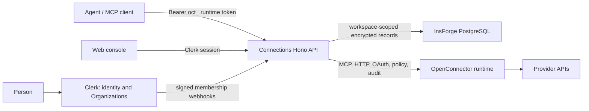

# Connections

Connections is a shared SaaS for workspace-scoped provider connections and MCP access. It is built on the OpenConnector provider runtime, but the product is a multi-workspace application: a Clerk Organization maps to one Connections workspace.

People connect their work accounts once, then approved AI agents use those accounts through MCP or the runtime API. Provider credentials stay on the server; agents receive only safe account metadata, action schemas, and execution results.

## Why Connections?

Teams should not have to share credentials, recreate integrations for every teammate, or give an AI agent a blanket key to everything. Connections turns individual provider accounts into a shared, governed workspace capability.

- **Connect once; collaborate intentionally.** Each person connects the accounts they own. Managers and admins can select and use every permitted account in their workspace without ever seeing its raw credentials.
- **Give agents useful access, not unlimited access.** An MCP client receives a revocable token and must choose an explicit, labelled connection for each action.
- **Keep every team private by design.** Organizations are isolated workspaces: their people, accounts, tokens, runs, files, and provider configuration never cross into another Organization.

The result is a single connection layer for people and AI: team-wide when authorized, account-specific when executing, and safe to operate across multiple teams.

## What works today

- Clerk sign-in, organization switching, organization profile, invitations, and membership management.
- Workspace-scoped provider enablement, OAuth client configuration, connection accounts, runtime tokens, runs, files, approval settings, and audit events.
- Multiple clearly labelled accounts per provider, such as `personal-gmail` and `finance-gmail`.
- MCP discovery and execution across the provider catalog, with an explicit account label required for every action.
- Member, manager, and admin authorization enforced by the Hono API.
- Encrypted credential storage in PostgreSQL (InsForge) for production; SQLite for local development.
- Workspace archive, restore, and scheduled purge lifecycle: archived data is unavailable immediately, restorable for 14 days, then permanently erased.

## Workspace roles and isolation

Clerk owns identity, organization membership, invitations, and organization profile. Connections synchronizes that membership into its own authorization data so runtime API keys take effect immediately when roles change or a member is removed.

| Role    | Connections permissions                                                                                                                                    |
| ------- | ---------------------------------------------------------------------------------------------------------------------------------------------------------- |
| Member  | Uses and manages only their own connections, runtime tokens, runs, and temporary files. Can use only workspace-enabled providers.                          |
| Manager | Can use and manage all workspace connections, tokens, runs, and files. Can enable providers, configure OAuth, set approval rules, and review audit events. |
| Admin   | Has manager capabilities and can archive or restore the Connections workspace data.                                                                        |

Each opaque runtime token is stored only as a hash and is bound to the creating user and workspace. On every request, the server resolves the token's workspace and current role from server-side data. MCP clients do not send, choose, or override a workspace ID.

Consequently, a token issued in Organization 1 can discover and use only Organization 1 data. It cannot list, select, or execute a connection owned by Organization 2, even if it knows that connection's label. Removing a member, revoking a token, or archiving a workspace blocks that token immediately.

## Architecture



The browser never accesses InsForge directly. The Connections API is the authorization and data boundary for the console, MCP, OAuth, provider execution, audit events, and temporary file transit.

### MCP and runtime API

MCP is available at `/mcp`. Authenticate every request with a runtime token:

```http
Authorization: Bearer oct_…
```

The MCP workflow is:

1. Call `list_apps` to see enabled providers and the connection labels the token may use.
2. Call `search_actions` and `get_action_guide` to inspect an action.
3. Call `execute_action` with the exact `connectionName` returned by discovery.

`connectionName` is mandatory. Connections never silently chooses a default account for an agent.

The HTTP API exposes the generated OpenAPI document at `/openapi.json` and interactive reference at `/docs`. Runtime action calls use `/v1/actions/{actionId}` and also require `connectionName`.

## Deploy with Docker and Coolify

The repository Compose file builds the application from the current source, including the web console. In Coolify, select Docker Compose and deploy the repository root on `main`.

The service listens on port `3000`; configure Coolify's domain to route to that port. The health endpoint is `/health`.

Set these production environment variables in Coolify:

| Variable                          | Purpose                                                                                                                                                                               |
| --------------------------------- | ------------------------------------------------------------------------------------------------------------------------------------------------------------------------------------- |
| `OOMOL_CONNECT_ORIGIN`            | Public HTTPS origin, for example `https://connections.example.com`. Used for OAuth callbacks and generated URLs.                                                                      |
| `DATABASE_URL`                    | PostgreSQL connection string for the Connections database.                                                                                                                            |
| `OOMOL_CONNECT_ENCRYPTION_KEY`    | Server-only key that encrypts stored provider credentials and OAuth client secrets. Keep it stable; changing it without a key-rotation procedure makes old encrypted data unreadable. |
| `CLERK_SECRET_KEY`                | Server-only Clerk key used to verify human sessions.                                                                                                                                  |
| `CLERK_PUBLISHABLE_KEY`           | Clerk public key. It is also supplied at Docker build time so the Vite console can load Clerk.                                                                                        |
| `CLERK_MEETINGLY_OAUTH_CLIENT_ID` | Public Clerk OAuth client ID accepted by the organization-scoped Meetings API.                                                                                                        |
| `CLERK_WEBHOOK_SIGNING_SECRET`    | Verifies Clerk membership webhooks. Configure Clerk to send organization membership events to `https://your-domain/api/webhooks/clerk`.                                               |

Useful optional controls:

| Variable                                                          | Purpose                                                                                                                                                     |
| ----------------------------------------------------------------- | ----------------------------------------------------------------------------------------------------------------------------------------------------------- |
| `OOMOL_CONNECT_ALLOWED_ACTIONS` / `OOMOL_CONNECT_BLOCKED_ACTIONS` | Comma-separated global action policy controls.                                                                                                              |
| `OOMOL_CONNECT_ALLOWED_PROXIES` / `OOMOL_CONNECT_BLOCKED_PROXIES` | Comma-separated global provider-proxy policy controls.                                                                                                      |
| `OOMOL_CONNECT_TRANSIT_FILE_TTL_SECONDS`                          | Temporary file lifetime; defaults to one day.                                                                                                               |
| `OOMOL_CONNECT_TRANSIT_FILE_MAX_BYTES`                            | Temporary file size limit; defaults to 100 MiB.                                                                                                             |
| `OOMOL_CONNECT_ALLOW_PRIVATE_NETWORK`                             | Enables trusted self-hosted provider instances on private networks. Keep it unset unless required. Loopback, reserved, and metadata targets remain blocked. |

Before the first production deploy, apply the repository's PostgreSQL migrations to the target InsForge project:

```bash
npx @insforge/cli db migrations up --all
```

Use the parent Connections project—not an InsForge branch—and confirm the migration history before applying changes.

## Local development

Use Node.js 24 and npm:

```bash
npm install
npm run dev
```

The API listens on `http://localhost:3000`; the Vite console runs on `http://localhost:5173`. Without `DATABASE_URL`, local development uses SQLite under the runtime data directory. Without Clerk keys, it uses a single local admin workspace only; do not use that fallback in production.

To validate changes:

```bash
npm run fix-check
npm test
npm run build --workspace web
```

## Technical notes

- Provider definitions generate the catalog; provider executors are loaded only when an action or credential validation needs them.
- All provider network egress uses the shared SSRF-protected fetch layer.
- Provider credentials, OAuth configurations, runtime tokens, runs, provider enablement, approval rules, files, and audit events are persisted with a workspace boundary.
- Credentials and OAuth configuration are encrypted server-side. Runtime token plaintext is returned only at creation; the database stores a SHA-256 hash.
- Clerk Organization membership webhooks synchronize the effective workspace role. Removing a member revokes their runtime tokens and removes their owned provider connections.
- The MCP API exposes safe account labels and profiles only—never raw provider credentials or OAuth tokens.

## Product references

- [Product vision](connections-docs/VISION.md)
- [Locked product and architecture decisions](connections-docs/LOCKED.md)
- [Deployment, debugging, and database operations](connections-docs/OPERATIONS.md)
- [InsForge schema](connections-docs/insforge-schema.sql)
- [Contributing](CONTRIBUTING.md)
- [Security policy](SECURITY.md)

## License

Unless otherwise noted, this repository is licensed under Apache-2.0. Provider names and trademarks belong to their respective owners and are used only for identification and interoperability.
